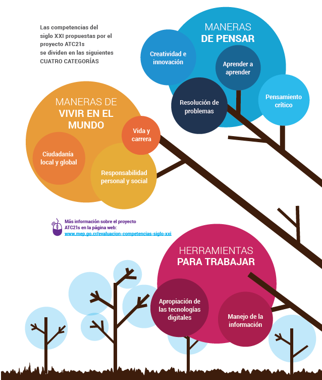

# Aprendizaje no supervisado aplicado a la calificación de competencias en maestros del sistema educativo colombiano.
## Introducción
Este proyecto fue desarrollado por el Equipo 6 de la asignatura "Aprendizaje no Supervisado" de la Maestría en Inteligencia Analítica de Datos - MIAD, en su cohorte 2023

El equipo 6 está conformado por:
* Jorge Caballero,
* Rebeca Gamboa,
* Javier Abril
* Jesus Parada

El objetivo principal es identificar grupos desconocidos de docentes basados en sus competencias multidisciplinarias y detectar diferencias en los patrones de competencia que puedan indicar áreas de mejora para los programas de formación. Para lograr esto, emplearemos técnicas de aprendizaje no supervisado, como el clustering y sistemas de recomendación. Utilizaremos un dataset proporcionado por la Fundación Future Education (se modifica el nombre de la organización para mantener la reserva) que incluye las respuestas a estas 20 preguntas, así como información socio-demográfica de un grupo de maestros. Esta encuesta se utiliza para medir el nivel de desempeño en 5 competencias docentes clave, que luego se utilizarán para guiar los procesos de capacitación de los docentes. En última instancia, nuestro objetivo es encontrar nuevos patrones en los datos que permitan una dirección más efectiva de los esfuerzos de formación y evaluar la relevancia del instrumento de medición. La aplicación de modelos de Machine Learning y la inteligencia artificial en este contexto es fundamental para el progreso en el campo de la educación, particularmente en las áreas de evaluación y enseñanza.

La base de datos contiene 5270 observaciones y 33 variables (incluidas las 20 preguntas) que muestran las respuestas de los docentes, maestros y agentes educativas de las instituciones educativas o centros de desarrollo infantil en todo el territorio colombiano donde hace presencia la Organización. Se reporta información de 2022 y lo corrido del año 2023 para personas mayores de 18 años. 

Algunas de las ideas de valor a generar fueron:

1. Evaluar si todas las preguntas son necesarias para conocer el nivel de desempeño de una competencia (por reducción de dimensionalidad)
2. Validar si es correcto que cada competencia solo es explicada por las preguntas asignadas (mediante la revisión de los niveles de cada competencia en clusters generados)
3. Revisar si existen grupos multidisciplinares en los maestros, para ajustar programas de formación a estos grupos (mediante el análisis de clusters).
## Introducción
La fundación Future Education (se modifica el nombre real de la entidad por confidencialidad) tiene como propósito promover practicas innovadores en la educación colombiana. Uno de los instrumentos que implementa en sus proyectos es una encuesta que busca medir las competencias que tienen maestros/docentes/agentes educativos y que son fundamentales para mejorar la calidad de la educación.

Las Competencias del Siglo XXI es una adaptación del capítulo latinoamericano del proyecto ATC21s por sus siglas en ingles "Assessment and Teaching of 21 st Century Skills" de la Fundación Omar Dengo. 

Este instrumento consta de 20 preguntas asociadas a 5 competencias:
* Creatividad e innovación.
* Pensamiento crítico.
* Resolución de problemas.
* Comunicación.
* Trabajo colaborativo.

El objetivo general del proyecto es la aplicación de técnicas de aprendizaje no supervisado para el análisis de los resultados de 5270 encuestas.

En un inicio, se espera encontrar grupos no conocidos de competencias multidisciplinares de acuerdo con las respuestas a sus preguntas. Utilizando estos grupos, se planea enfocar los esfuerzos de capacitación de acuerdo con estas necesidades, al estilo de un sistema de recomendación. Otra opción puede ser encontrar grupos con niveles de competencias similares, dando un “Score” basado en los grupos de respuestas de preguntas y enfocando la educación de acuerdo con el “alumno típico” de cada uno de estos grupos. El alcance de este proyecto llega hasta la obtención de estos grupos, y la validación de los grupos obtenidos, y por tanto, dar respuesta las preguntas: ¿Existen grupos formados por las respuestas y características socio demográficas de los docentes suficientemente separados para a futuro dar recomendaciones o asignar niveles de competencias multidisciplinares para brindar educación especializada? 
Al potenciar los esfuerzos de capacitación de los docentes en las competencias dadas, se puede llegar a agilizar la mejora en la calidad de educación de américa latina: mejores docentes más rápido hace que los alumnos estén más rápidamente expuestos a una mejor educación. Este tipo de acercamientos hasta ahora han empezado a emerger en américa latina, por lo que se considera un caso interesante para la aplicación de estas metodologías.

## Revisión preliminar de literatura
En la literatura, se han tenido acercamientos más que todo enfocados a estudiantes, cómo en el paper desarrollado por Bagunaid et al en el 2022.  En este paper, se utilizan diversas metodologías para llegar a un puntaje que se usa en clustering por DBSCAN con distancia Mhalanobis. Luego, se hace un ajuste para el desempeño individual del estudiante y esta información procede a un sistema de recomendación para brindar opciones de aprendizaje adicional a los estudiantes.  Igualmente, en el documento mencionan en su revisión de literatura que en las evaluaciones de estudiantes no se suele tener en cuenta las recomendaciones, sino que se da un puntaje que no necesariamente tiene en cuenta sus competencias individuales.
Revisando el Systematic Review para el Student Assessment de González-Calatayud, se observa que no existen contribuciones significativas de en américa latina sobre el uso de inteligencia artificial para evaluar al estudiante hasta su publicación en junio del 2021. No obstante, en 15 de los 22 papers que eligieron se tocan temas de Inteligencia Artificial para el assessment formativo, además de mostrar 10 papers que tratan del scoring automático de competencias afines a las evaluadas en la encuesta usada en este proyecto (por ejemplo, en Kaila et al. se evalúa el trabajo colaborativo).

## Metodología propuesta
A un macro nivel, se espera:
1.	Estandarizar y codificar los datos, preparándolos para ser usados en las metodologías dadas. 
1.	Generar Clusters de los datos. Dada la naturaleza de los datos, seguramente se usarán algoritmos de clustering que admitan variables categóricas codificadas. Por ahora, se planea usar al menos DBSCAN.
1.	Evaluar los clusters encontrados.
        1. Usando la clasificación actual de las competencias, revisar si existen diferencias en los niveles de competencias entre los grupos encontrados y caracterizarlos. 
        1. Evaluar la calidad de los grupos encontrados usando las metodologías apropiadas de los algoritmos usados

1.	Concluir sobre los resultados.
      1.	Concluir sobre la separación de los grupos y la viabilidad de a futuro aplicar sistemas de recomendación de contenido 
      1.	Concluir sobre si existe información suficiente en la encuesta para dar resultados, o si por el contrario hay preguntas redundantes en la clasificación 
      1.	Dar conclusiones en relación con las ventajas y desventajas de no dar 5 puntajes sino la pertenencia a un grupo de competencias multidisciplinar.

## Metodología realizada

### Consistencia interna del instrumento / Coeficiente Alfa de Cronbach
Este coeficientes es comunmente utilizado para evaluar la confiabilidad y la consistencia de investigaciones de cuestionarios o entrevistas. Shavelson (2009 ) indica que dicho coeficiente tiene los siguientes beneficios:
1.	Provee una medida razonable de confiabilidad en un único test.
2.	La fórmula general del coeficiente permite su aplicación a cuestionarios de opción multiple de estalas dicotómocas o de variables categóricas politómicas
3.	Puede ser calculado con principios estadísticos básicos

En términos generales la aplicación del instrumento a la encuesta da como resultados se obtuvo un valor general de Alpha de 0,726 lo que indica una confiabilidad buena. Los ítems de la escala están razonablemente correlacionados y la medida es considerada confiable para su uso en la mayoría de los casos. Sin embargo, las preguntas que miden cada competencia no son consistentes, tienen una baja confiabilidad, lo que implica que no parece ser la mejor manera de agruparlas.

## Bibliografía

* Bagunaid, W., Chilamkurti, N., & Veeraraghavan, P. (2022). AISAR: Artificial Intelligence-Based Student Assessment and Recommendation System for E-Learning in Big Data. Sustainability, 14(17), 10551. doi: 10.3390/su141710551
* González-Calatayud, V., Prendes-Espinosa, P., & Roig-Vila, R. (2021). Artificial Intelligence for Student Assessment: A Systematic Review. Appl. Sci., 11(12), 5467. doi: 10.3390/app11125467
* Minn, S. (2022). AI-assisted knowledge assessment techniques for adaptive learning environments. Computers and Education: Artificial Intelligence, 3, 100050. doi: 10.1016/j.caeai.2022.100050
* Deisenroth, M. P., Faisal, A. A., & Ong, C. S. (2020). Mathematics for machine learning. Cambridge University Press.
* Goodfellow, I., Bengio, Y., & Courville, A. (2016). Deep learning. MIT press.
* Hastie, T., Tibshirani, R., & Friedman, J. H. (2009). The elements of statistical learning: data mining, inference, and prediction. 2nd ed. New York: Springer.
* Murphy, K. P. (2012). Machine learning: a probabilistic perspective. MIT press.
* Peña, D. (2002). Análisis de datos multivariantes (Vol. 24). Madrid: McGraw-hill.
* Amat Rodrigo, Joaquín (2022). Clustering con Python. Available under a Attribution 4.0 International (CC BY 4.0) at https://www.cienciadedatos.net/documentos/py20-clustering-con-python.html. (Accedido 9 de Enero 2022)
* Hastie, T., Tibshirani, R., & Friedman, J. H. (2001). The elements of statistical learning: Data mining, inference, and prediction. New York: Springer.
* Jones, Aaron; Kruger, Christopher; Johnston, Benjamin. The Unsupervised Learning Workshop: Get started with unsupervised learning algorithms and simplify your unorganized data to help make future predictions. Packt Publishing. Kindle Edition.
* Kaufman, L. & Rousseeuw, P. (1990). Finding Groups in Data: An Introduction to Cluster Analysis, Wiley, New York.
* Macnaughton Smith, P., Williams, W., Dale, M. & Mockett, L. (1965). Dissimilarity analysis: a new technique of hierarchical subdivision, Nature 202: 1034–1035.
* Pedregosa, F. et al., 2011. Scikit-learn: Machine learning in Python. Journal of machine learning research, 12(Oct), pp.2825–2830.
* Fabila, Angelica & Minami, Hiroe & Izquierdo, Jesús. (2013). La escala de Likert en la evaluación docente: acercamiento a sus características y principios metodológicos. perspectivas docentes. 52.
* Shavelson, R.J. Biographical memoirs: Lee J. Cronbach. Washington, DC-USA: American Philosophical Society, v. 147, n. 4. p. 379-385, 2009.
